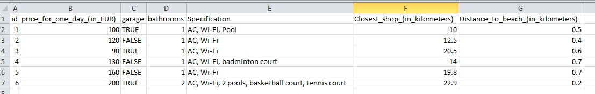
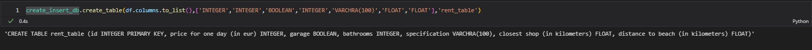
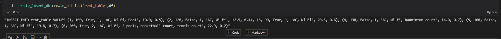
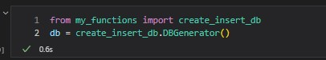
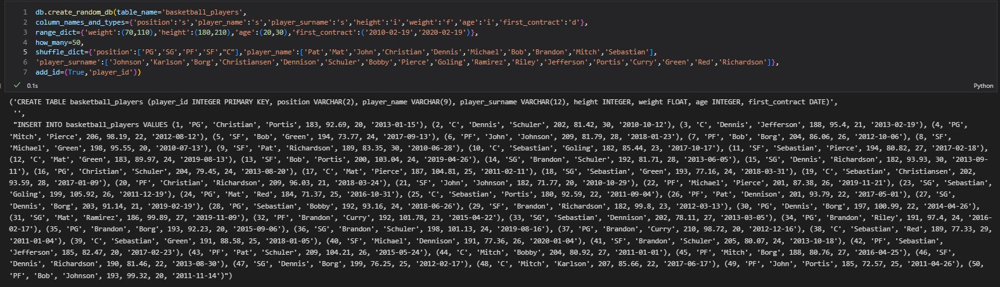

# Database generator for learning purposes

## Assumption of the project
As I was learning SQL syntax and solving different interview questions - I have spent a lot of time on creating tables and inserting values "manually" (i.e. I have written SQL queries for inserting rows one by one, so to speak. I also entered data in Excel columns, making some functions to generate random data each and every time). Idea came up that maybe I could automate this process a little bit (by just declaring what I would like to have in database and I will just get code for pasting to Query tool for creating tables and populating them with values)


## "Installation" process

I put file with script in Lib/site-packages folder where all packges reside. I have created there a separate folder ("my functions") and I import relevant functions or a class 

## Description of functions

I will show the example of usage by considering below data in csv file:




### create_table

create_table(columns,types,table_name)

functions requires 3 params:

* columns - > list of headers
* types - > list of types of the columns (in SQL "format" so INTEGER, FLOAT, etc.)
* table_name -> string for table name

Below is the example of how syntax looks like and could be used

```
create_insert_db.create_table(df.columns.to_list(),['INTEGER','INTEGER','BOOLEAN','INTEGER','VARCHRA(100)','FLOAT','FLOAT'],'rent_table')
```

The returning value would be the below string:



NOTE! -> first column will be always treated as **PRIMARY KEY**

### create_entries

create_insert_db.create_entries(table_name,df)

function requires 2 params:

* table_name -> string for table name
* df -> dataframe with data we would like to insert to database

Below is the example of how syntax looks like and could be used:

```
create_insert_db.create_entries('rent_table',df)
```

The returning value would be the below string:




## DBGenerator class

DB Generator is a class that encompasses more functionalities than previously explained function

Once it is initiated:



We can used a function that will generator random data for us in one go

### create_random_db

```
create_random_db(self,add_id= (False,None),table_name= None,column_names_and_types=None,how_many=None,shuffle_dict=None,range_dict=None)
```
function requires a couple of params:

* add_id -> tuple with first values as True or False indiating if we would like to add ID column with PRIMARY KEY, second value is the name of the column we would like to assign. 
**Default option is not to generate PRIMARY KEY column**

* table_name -> string with the name of a table
* column_names_and_types -> dictionary with keys as column names and values as types of columns

As value you can use below mapping representing specific types:

1. "i" - INTEGER
2. "f" - FLOAT
3. "d" - DATE
4. "dt" - TIMESTAMP
5. "s" - VARCHAR (number of characters will be determined by checking the longest string available)

* how_many -> integer indicating how many records we want to generate

* shuffle_dict -> dictionary with keys indicating column names and values as lists we would like to use for picking random values

* range_dict -> dictionary with keys indicating column names and value as tuples with 2 items indicating ranges (min,max) for generating random values

Below is the example of how syntax looks like and could be used:

```
db.create_random_db(table_name='basketball_players',
column_names_and_types={'position':'s','player_name':'s','player_surname':'s','height':'i','weight':'f','age':'i','first_contract':'d'},
range_dict={'weight':(70,110),'height':(180,210),'age':(20,30),'first_contract':('2010-02-19','2020-02-19')},
how_many=50, 
shuffle_dict={'position':['PG','SG','PF','SF',"C"],'player_name':['Pat','Mat','John','Christian','Dennis','Michael','Bob','Brandon','Mitch','Sebastian'],
'player_surname':['Johnson','Karlson','Borg','Christiansen','Dennison','Schuler','Bobby','Pierce','Goling','Ramirez','Riley','Jefferson','Portis','Curry','Green','Red','Richardson']},
add_id=(True,'player_id'))
```

The returning value will be tuples of 3 elements. Second is just to make separation. First one is string for generating table, third one is for inserting values to created table:



## Technologies
* Python (pandas, numpy, random, datetime)

